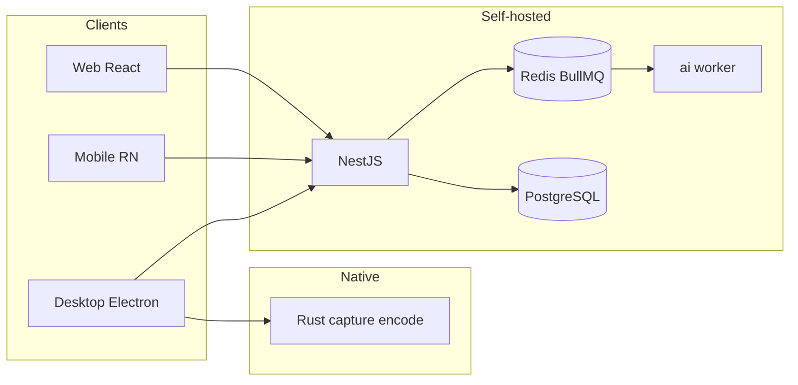

# Technical advantages: why VistaRemote

> For **executives**, **IT leaders**, **operations**, and **developers** — how our architecture choices translate into **faster delivery, lower risk, and better remote-desktop experience**.

Normative: [ADR-0007](https://github.com/VistaRemote/vibeCode/blob/main/adr/0007-no-flutter-cross-platform-ui.md) · [ADR-0003](https://github.com/VistaRemote/vibeCode/blob/main/adr/0003-rust-not-cpp-for-native.md) · [ADR-0006](https://github.com/VistaRemote/vibeCode/blob/main/adr/0006-bullmq-async-jobs.md)

---

## 30-second summary

| You care about | VistaRemote answer |
| :--- | :--- |
| **Time to market** | TypeScript everywhere, **sub-second Rsbuild** cold start, Docker Compose stack |
| **Vendor lock-in** | **Open source**, **self-hosted** PostgreSQL / MinIO / on-prem AI |
| **Smooth remote control** | **WebRTC** + client-side GPU encode + optional **Rust** for DXGI/NVENC |
| **AI governance** | Separate `ai` service, **Ollama in VPC**, **BullMQ** retries & visibility |
| **Hiring** | **React / NestJS / RN** — no forced **Flutter + native** dual track |

---

## For executives and business owners

### Spend on outcomes, not two stacks

Flutter’s pitch is “one UI codebase.” For remote desktop, **capture, hardware encode, and global input hooks** are **not Dart problems** — you still need **Rust/C++** engineers.

VistaRemote uses **React for product UI** and **Rust only where it matters**. Fewer surprises in budget and timeline.

### Delivery speed is a competitive edge

- **Meta-Repo multi-repo**: clone only `web` + `server` for a demo.
- **Rspack/Rsbuild**: Rust-powered bundling — **hundreds of ms** cold starts.
- **Spec-driven development**: requirements trace to FR IDs.

### Data stays on your infrastructure

Recordings, audit logs, and AI summaries can run entirely in your **VPC** — a strong story vs closed monitoring vendors.

See [Positioning](./positioning) and [Docker deploy](/deploy/docker).

---

## For IT and operations

### Familiar, small footprint

| Component | Role | Why it helps |
| :--- | :--- | :--- |
| **PostgreSQL 16** | App data | Standard ops in CN/EU SMB |
| **Redis** | Sessions + **BullMQ** | No extra Kafka/RabbitMQ cluster |
| **Docker Compose** | Full stack | Templates in `deploy` repo |
| **mediasoup** | SFU sidecar | When 1:N viewers need it |

Background AI uses **BullMQ**, not a log pipeline — see [Job queue](./job-queue).

### Predictable performance path

Ship first on Electron/TS; add **Rust** in `desktop/native` by ROI — without rewriting the product in another UI framework.

---

## For developers

### Mainstream stack

- Web / Admin / Desktop UI: **React 19 + antd + Rsbuild**
- Mobile: **React Native + JSI** + `react-native-webrtc`
- Server: **NestJS + PostgreSQL**
- Contracts: `@vistaremote/shared`

Flutter’s GPU story targets **widget rendering**, not **WebRTC + OS APIs**. Details: [Cross-platform stack](./cross-platform-stack).

### Rust in the right places

- **Rspack**: Rust for **build speed**
- **desktop/native**: **N-API** for Electron; native modules for RN

### AI decoupled from signaling

`server` enqueues → **BullMQ** → `ai` worker → Ollama / Qdrant. Heavy ML only in `python-worker`.

---

## Architecture snapshot

---

## Related

- [Positioning](./positioning)
- [Cross-platform stack (no Flutter)](./cross-platform-stack)
- [Developer handbook](/guide/developer-handbook)
