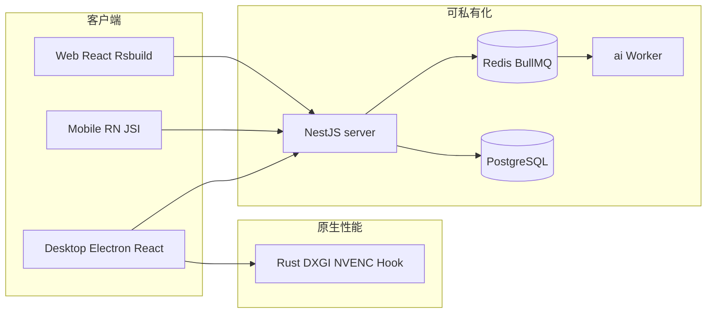

# 技术选型优势：为什么选 VistaRemote

> 本文面向 **企业决策者（老板、IT 负责人）**、**运维** 与 **开发者**，说明 VistaRemote 的架构选型如何转化为 **更快交付、更低风险、更好体验** — 而不只是「用了什么框架」。

规范依据：Meta-Repo [ADR-0007](https://github.com/VistaRemote/vibeCode/blob/main/adr/0007-no-flutter-cross-platform-ui.md) · [ADR-0003](https://github.com/VistaRemote/vibeCode/blob/main/adr/0003-rust-not-cpp-for-native.md) · [ADR-0006](https://github.com/VistaRemote/vibeCode/blob/main/adr/0006-bullmq-async-jobs.md)

---

## 30 秒结论

| 您关心什么 | VistaRemote 的答案 |
| :--- | :--- |
| **能不能尽快上线？** | 全栈 **TypeScript** + **Rsbuild 秒级构建** + Docker 一键栈，二开以天计而非月计 |
| **会不会被厂商绑架？** | **开源可审计** + **私有化部署**（PostgreSQL、MinIO、内网 AI） |
| **画面卡不卡、稳不稳？** | **WebRTC** 实时链路 + 端侧 **GPU 编码** + 可选 **Rust** 压榨 DXGI/NVENC |
| **AI 数据敢不敢用？** | 独立 `ai` 服务 + **Ollama 内网** + BullMQ 可重试、可观测 |
| **团队招不招得到人？** | **React / NestJS / RN** 国内主流栈，**不** 强推 Flutter 双轨 |

---

## 给决策者：老板与业务负责人

### 1. 把钱花在业务上，而不是「养两套技术栈」

业界常推销 **Flutter「一套代码三端」**。对远程桌面而言：

- 真正吃性能的是 **截屏、硬件编码、全局键鼠** —— 这些 **Flutter/Dart 做不了**，仍要 **Rust/C++** 原生团队。
- 选 Flutter 往往变成：**Dart 做 UI + 原生做底层**，沟通与排期成本翻倍。

VistaRemote 选择 **React 做 UI、Rust 只做该做的事**：控制台与 Admin 用成熟 Web 技术快速迭代；性能热点用 Rust（N-API）接入 Electron，**路线清晰、预算可控**。

### 2. 交付速度 = 竞争优势

- **Meta-Repo 分仓**：避免 Monorepo 里 Electron 与 RN 依赖地狱；只拉 `web`+`server` 也能跑通演示。
- **Rspack/Rsbuild（Rust 写的打包器）**：冷启动 **数百毫秒级**，迭代节奏接近互联网产品而非传统远控大版本。
- **Spec 驱动**：需求进 Spec、AI 与人工按 FR 实现，减少「口头需求」返工。

**对老板的含义**：同样人力，更快出可演示、可签单的私有化版本。

### 3. 合规与信任：数据在自家机房

- 录像、审计、AI 摘要均可落在 **企业 VPC**（PostgreSQL + MinIO + Redis + 可选 Ollama）。
- 相对闭源监控厂商：**无黑盒云分析、无强制出境**，利于等保与内审叙事。

详见 [产品定位](./positioning) · [Docker 部署](/deploy/docker)。

---

## 给 IT 负责人与运维

### 1. 组件少、栈熟、好维护

| 组件 | 角色 | 为何省心 |
| :--- | :--- | :--- |
| **PostgreSQL 16** | 业务库 | 国内 DBA 最熟，云 RDS 现成 |
| **Redis** | 会话、信令 Pub/Sub、**BullMQ 队列** | **不另起** RabbitMQ/Kafka 集群 |
| **Docker Compose** | 单机/内网全栈 | `deploy` 仓模板化，见 [deploy-spec](https://github.com/VistaRemote/vibeCode/blob/main/spec/deploy-spec.md) |
| **mediasoup** | SFU 侧车 | 按需启用，非千万级直播栈 |

**不引入 Kafka** 运维地狱：AI 审计是 **任务队列** 场景，BullMQ 原生支持延迟重试与任务状态，见 [异步任务队列](./job-queue)。

### 2. 性能演进可预期

- **阶段 A**：Chromium/Electron + 现有 TS 能力先上线。
- **阶段 B**：按 ROI 在 `desktop/native` 用 **Rust** 替换 DXGI/NVENC 瓶颈 —— **不** 推翻业务代码。

运维侧：**不必** 为「未来 Rust」单独采购 Flutter 团队或第二套 CI。

### 3. 多端一致、问题好定位

信令 **WebSocket**、通知 **SSE**、控场 **DataChannel**、后台任务 **BullMQ** —— 职责分离，日志与监控边界清楚。见 [消息与传输](./messaging-transport)。

---

## 给开发者：为什么愿意在这个项目上投入

### 1. 主流技术栈，简历与社区都友好

- **Web / Admin / Desktop UI**：React 19 + antd + Rsbuild
- **Mobile**：React Native 新架构 + **JSI**（`react-native-webrtc` 热路径）
- **Server**：NestJS + TypeORM + PostgreSQL
- **契约**：`@vistaremote/shared` 单点真相

「Flutter GPU 比 JS 快」在远控场景 **不成立**：瓶颈在 **WebRTC 与 OS API**；RN 的 JSI 已解决旧桥接延迟。详见 [跨端技术栈](./cross-platform-stack)。

### 2. Rust 用在刀刃上

- **Rspack**：Rust 加速 **构建**，你每天 `pnpm dev` 都能感知。
- **desktop/native**：Rust 通过 **N-API** 喂给 Electron；RN 侧 **Native Module + JSI** —— Rust 工程师可专注音视频，前端不被拖进 C++。

### 3. AI 与业务解耦、可本地调试

- `server` 入队 → **BullMQ** → `ai` Worker → Ollama / Qdrant
- 重 ML 仅在 `python-worker`，主逻辑仍是 TS

本地一条龙：[AI 本地开发](/deploy/ai-local-dev)。

---

## 架构选型一览

---

## 与常见方案的对比（摘要）

| 维度 | 传统闭源远控 | Flutter 三端方案 | VistaRemote |
| :--- | :--- | :--- | :--- |
| 实时远程 | 弱或另购 | 取决于实现 | **WebRTC 原生** |
| UI 技术 | 私有 / 老 C++ | Dart | **React 系** |
| 底层截屏编码 | 黑盒 | 仍需原生插件 | **Rust 明确路线** |
| 后台 AI 任务 | 厂商云 | 自研成本高 | **BullMQ + 私有化 ai** |
| 二开 | 难 | 中（双栈） | **TS 全栈 + Spec** |
| 运维组件 | 不透明 | 常膨胀 | **PostgreSQL + Redis + Compose** |

---

## 下一步阅读

| 角色 | 推荐 |
| :--- | :--- |
| 采购 / 老板 | [产品定位](./positioning) · [套餐与计费](/user/plans-and-billing) |
| 架构师 | [架构总览](./overview) · [跨端技术栈](./cross-platform-stack) |
| 开发 | [开发者手册](/guide/developer-handbook) · [本地开发](/guide/local-development) |
| 运维 | [Docker 部署](/deploy/docker) |
